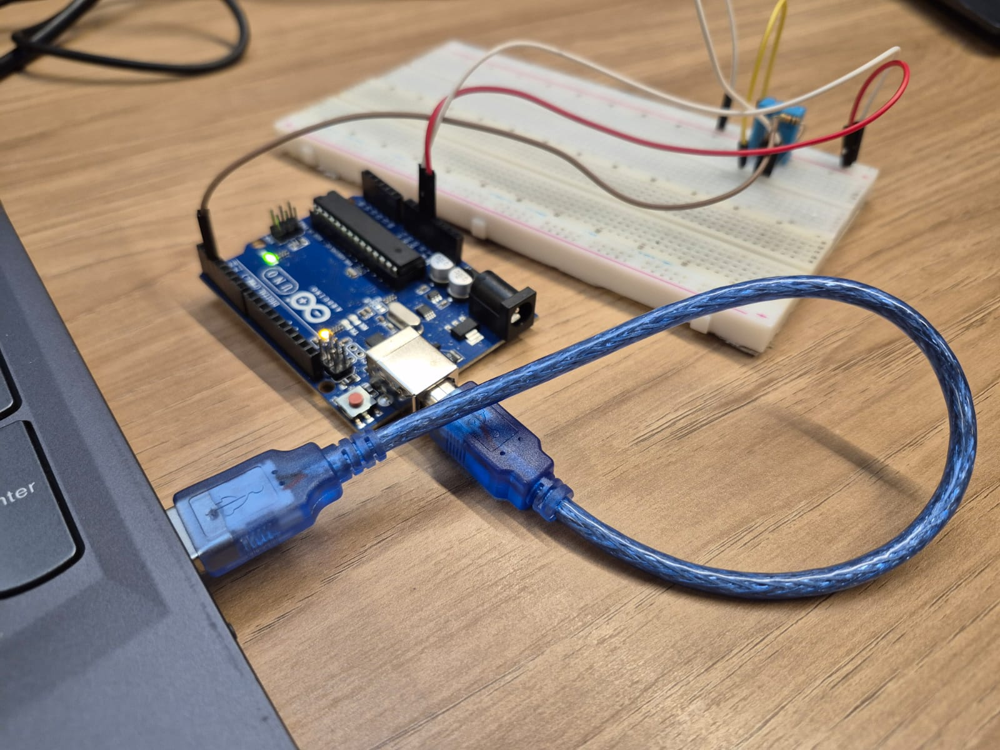
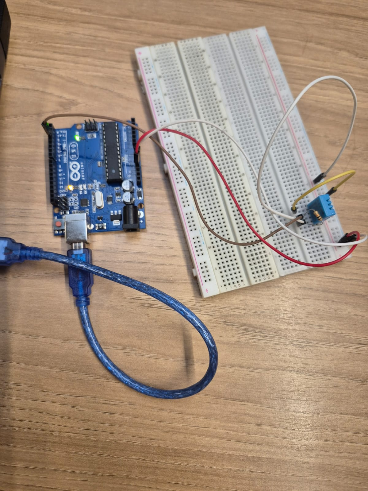
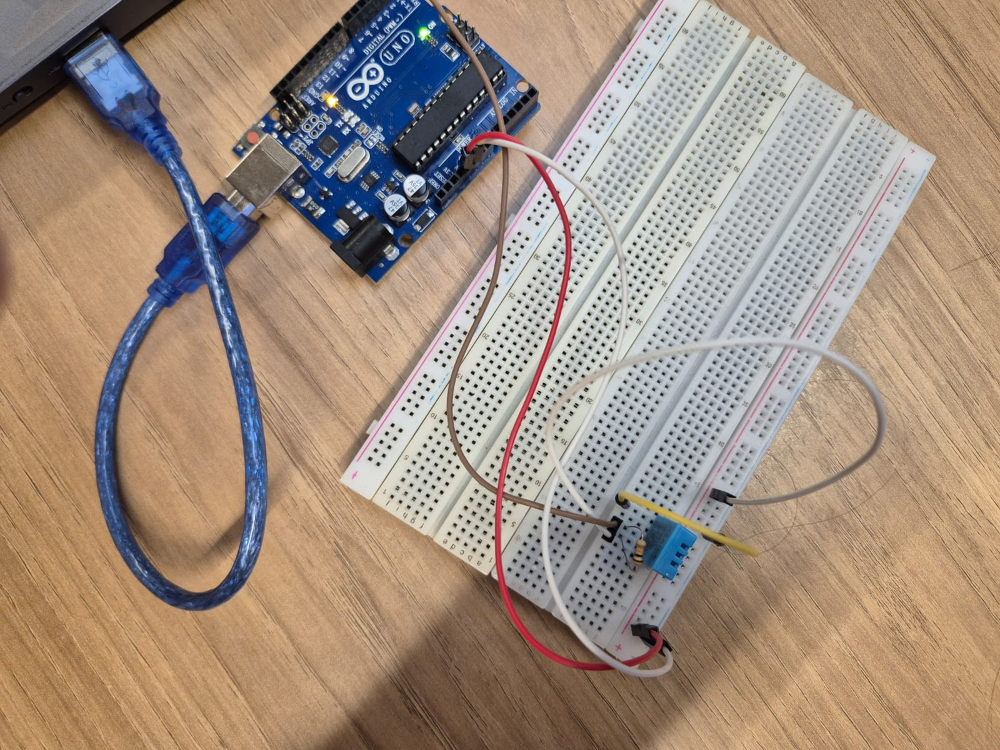

# Sistema de Medição Meteorológica

Aplicação Flask + SQLite para registrar e visualizar leituras meteorológicas (ex.: Arduino Uno + DHT11). Inclui:

- Painel com últimas leituras (cards + tabela) e gráficos (Chart.js)
- Histórico com scroll infinito e exclusão por linha
- Edição de uma leitura via formulário (PUT)

## Tecnologias

- Backend: Python, Flask, SQLite
- Leitura serial: `pyserial` + envio HTTP para a API
- Frontend: HTML (Jinja), Tailwind (build via PostCSS) e Chart.js (CDN)

## Instalação

### 1) Python (venv + dependências)

Crie e ative um ambiente virtual (se já existir, só ative):

Windows (PowerShell):

```bash
python -m venv venv
venv\Scripts\activate
```

macOS/Linux:

```bash
python3 -m venv venv
source venv/bin/activate
```

Instale as dependências Python:

```bash
pip install flask requests pyserial
```

### 2) CSS (opcional, mas recomendado)

O CSS servido pela aplicação é o arquivo compilado. Para instalar as dependências e (re)compilar:

```bash
cd src
npm install
npm run build:css
```

Para rebuild automático durante desenvolvimento:

```bash
cd src
npm run watch:css
```

## Como executar

### Backend (Flask)

Execute a partir da pasta `src`:

```bash
cd src
python -m flask --app app.scripts.app run --debug
```

O banco SQLite é inicializado automaticamente (schema) e fica em `src/app/db/dados.db`.

### Leitura serial (Arduino)

Em outro terminal, rode o leitor serial (ele lê JSON via serial e faz POST para a API):

```bash
cd src/app/scripts
python serial_reader.py
```

Notas:

- Ajuste a porta em `PORTA` (ex.: `COM8`) no arquivo `src/app/scripts/serial_reader.py`.
- O Arduino deve estar enviando linhas JSON com pelo menos `temperatura` e `umidade`.
- Feche o Serial Monitor do Arduino IDE antes de rodar o script (evita conflito na porta).

### Rodar Flask + serial_reader juntos (1 comando)

Se você já rodou `npm install` em `src`, pode iniciar os dois ao mesmo tempo:

```bash
cd src
npm run dev
```

## Rotas

### Páginas (HTML)

- `GET /` — Painel principal
- `GET /historico` — Histórico
- `GET /editar/<id>` — Tela de edição da leitura `id`

### API (JSON)

Base URL: `http://localhost:5000`

- `GET /leituras?limit=50&offset=0`
  - Lista leituras paginadas (usado no histórico com scroll infinito)
- `POST /leituras`
  - Cria uma leitura
  - Body (exemplo):
    ```json
    { "temperatura": 25.4, "umidade": 61.0, "pressao": 1013.2 }
    ```
- `GET /leituras/<id>`
  - Detalha uma leitura
- `PUT /leituras/<id>`
  - Atualiza temperatura/umidade/pressão
  - Body (exemplo):
    ```json
    { "temperatura": 26.0, "umidade": 60.5, "pressao": null }
    ```
- `DELETE /leituras/<id>`
  - Remove uma leitura (botão “Excluir” no histórico)
- `GET /api/estatisticas`
  - Placeholder (retorna `TODO`)

## Telas do protótipo






